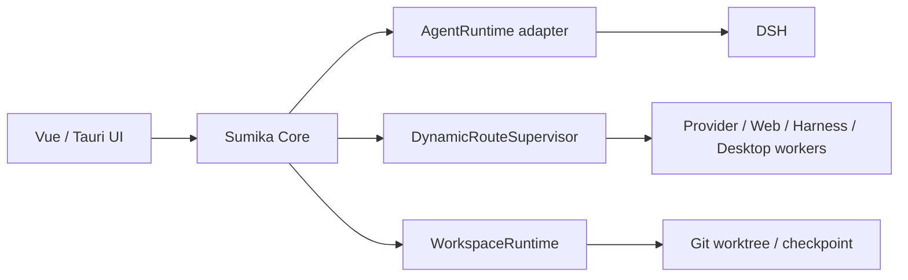

<div align="center">
  <a href="src-tauri/icons/sumika-icon-sharp-256.png">
    
  </a>
  <h1>Sumika</h1>
  <p><strong>A local-first, runtime-neutral desktop companion for agentic work.</strong></p>
  <p>
    <a href="README_zh.md">中文版</a>
    · <a href="docs/README.md">Documentation</a>
    · <a href="https://github.com/lostrain11/Sumika/issues">Issues</a>
  </p>
  <p>
    <a href="https://github.com/lostrain11/Sumika/actions/workflows/ccswitch-compatibility.yml">
      
    </a>
    
    
    
    
    
  </p>
</div>

> Sumika brings a character and Avatar desktop shell together with a replaceable
> Agent runtime, local data, explicit approvals, and provider-neutral capability
> boundaries. It is built to grow from a private companion into a dependable
> daily workbench without making one vendor or harness the permanent core.

## Project snapshot

<table>
  <tr>
    <td width="25%"><strong>Local first</strong><br>Data and runtime boundaries stay on the user's machine by default.</td>
    <td width="25%"><strong>Replaceable routes</strong><br>Providers, web workers, desktop apps, and harnesses use explicit adapters.</td>
    <td width="25%"><strong>Agent ready</strong><br>Sessions, plans, tools, approvals, MCP, Skills, Subagents, and workspace safety are exposed incrementally.</td>
    <td width="25%"><strong>Companion shell</strong><br>Characters, VRM Avatar rendering, and a transparent desktop pet remain first-class features.</td>
  </tr>
</table>

| Area | Current status |
| --- | --- |
| Desktop shell | Windows supported; macOS/Linux Tauri shell experimental |
| Agent runtime | Runtime-neutral contract with a DeepSeek Harness adapter |
| Dynamic routing | Evidence-aware supervisor and bounded worker dispatch; production auto-routing remains gated |
| Web workbench | Isolated BrowserSkill profiles, approvals, takeover, and web-chat projection |
| Workspace safety | Git worktrees, checkpoints, diff review, restore, and local commit gates |
| Character and Avatar | Persona editor, VRM viewer, gaze/head tracking, and desktop-pet presentation |

The [status matrix](docs/status-matrix.md) is the single source of truth for
completion status. This page summarizes verified boundaries and deliberately
does not advertise deferred work as finished.

## Start here

| Need | Link |
| --- | --- |
| Run Sumika on Windows | [Windows quick start](#windows) |
| Understand the architecture | [Architecture index](docs/architecture/README.md) |
| Check what is really implemented | [Status matrix](docs/status-matrix.md) |
| Resume development safely | [Current execution contract](docs/current-execution.md) |
| Configure providers and models | [Provider profiles](docs/architecture/provider-profiles.md) |



The supervisor is not a second language-model agent. It applies capability
evidence, permissions, budget, occupancy, and retry rules while the orchestrator
runtime makes semantic decisions. DSH is the current adapter, not a dependency
of the character, Avatar, workspace, or routing contracts.

---

The detailed platform, model, Avatar, security, and contribution notes follow.

## Platform details

| Platform | Python core and browser UI | Tauri desktop shell |
| --- | --- | --- |
| Windows | Supported | Supported |
| macOS | Supported command; see credential limitation below | Experimental |
| Linux | Supported command; see credential limitation below | Experimental |

Python 3.11 or newer is required on every platform. Sumika starts with LLM
disabled and no provider profile. Normal startup never installs Ollama, starts
a model service, or downloads model weights.

## Windows

Run the browser UI from PowerShell at the repository root:

```powershell
.\tools\run_core.ps1
```

Open [http://127.0.0.1:8770/](http://127.0.0.1:8770/). Browser data is stored
in `.sumika`. To select another Python executable:

```powershell
$env:SUMIKA_PYTHON = 'C:\Path\To\python.exe'
.\tools\run_core.ps1
```

For the desktop development shell, install frontend dependencies once and then
start Tauri:

```powershell
npm install --prefix frontend
.\tools\run-desktop.ps1
```

The desktop core listens on `127.0.0.1:8771` and stores its data in
`.sumika-desktop`. Use `-NoBuild` after a successful frontend build. Desktop
development also requires Rust with the MSVC target and the Windows C++ build
tools. The `.sh` files are legacy Windows Git Bash compatibility wrappers;
Git Bash is not a prerequisite or the documented Windows startup path.

## macOS

The currently supported entry point is the Python core and browser UI:

```bash
PYTHONPATH=backend/src python3 -m sumika_core \
  --host 127.0.0.1 --port 8770 --data-dir .sumika
```

Then open [http://127.0.0.1:8770/](http://127.0.0.1:8770/). Native
`tools/run_core.sh` and `tools/run-desktop.sh` launchers are reserved but
not implemented. The Tauri shell is experimental; contributors may try it
with Node.js, Rust, Xcode Command Line Tools, and the platform WebView:

```bash
npm install --prefix frontend
npm --prefix frontend run build
SUMIKA_PYTHON="$(command -v python3)" npm --prefix frontend run tauri:dev
```

## Linux

The currently supported entry point is the Python core and browser UI:

```bash
PYTHONPATH=backend/src python3 -m sumika_core \
  --host 127.0.0.1 --port 8770 --data-dir .sumika
```

Then open [http://127.0.0.1:8770/](http://127.0.0.1:8770/). Native
`tools/run_core.sh` and `tools/run-desktop.sh` launchers are reserved but
not implemented. The experimental Tauri path requires Node.js, Rust, a C
toolchain, and the WebKitGTK/system packages listed in the
[Tauri prerequisites](https://v2.tauri.app/start/prerequisites/):

```bash
npm install --prefix frontend
npm --prefix frontend run build
SUMIKA_PYTHON="$(command -v python3)" npm --prefix frontend run tauri:dev
```

macOS and Linux currently fail closed when a provider profile needs a saved
API key because an approved Keychain/Secret Service adapter has not been
implemented. Local endpoints without authentication remain usable.

## Configure a model

Open **Modules**, choose **Custom connection**, select a real template, enter
the endpoint and model, test the connection, and explicitly enable it. Ollama
is optional. Install it yourself if selected; after choosing a model, the
Windows-only helper can start/check Ollama and pull that explicit model:

```powershell
.\tools\setup-ollama.ps1 -Model 'qwen3:4b'
```

`qwen3:4b` is an editable example in the Ollama template, not a default
installation. The helper supports an explicit model cache through
`-ModelsDir` or `SUMIKA_OLLAMA_MODELS`.

The model directory is captured when the Ollama server starts. If Ollama is
already running with another directory, the helper will not pull a duplicate;
close and restart Ollama with `OLLAMA_MODELS` set, or use a separate port (see
the local-model guide).

The main window can open an optional always-on-top desktop-pet mode. The model
area is a Tauri drag region, so the floating pet can be moved around the
desktop. A compact chat input sits below the model and uses the same selected
character, session, and provider as the main window. Provider, module,
permission, and task configuration stays in the main window.

Desktop lifecycle and Python startup diagnostics are written to
`.sumika-desktop/logs/desktop.log`; core boundary diagnostics are written to
`.sumika-desktop/logs/core.log`. The Developer page and
`GET /api/diagnostics` show the safe log location and runtime counters. The
Tauri shell also shows the supervised core PID, endpoint, and restart count;
see `docs/architecture/debugging.md`. Logs never contain API keys, chat text,
or raw visual/audio data.

The desktop core listens on `127.0.0.1:8771` by default, while the browser
preview uses `127.0.0.1:8770`.

The Windows launcher first validates the pinned DSH executable at
`D:\Tools\DeepSeekHarness\0.1.1-rc.2\node_modules\.bin\dsh.cmd` (or an explicitly
configured absolute executable) and requires an exact `0.1.1-rc.2` `--version` result.
It never discovers a global `PATH` DSH. An explicitly configured
`SUMIKA_AGENT_ENDPOINT` / `SUMIKA_DSH_ENDPOINT` may opt into protocol-only external
reuse; `host.describe` does not prove the package version. A healthy default `3080`
endpoint with no explicit opt-in fails closed so the wrong Runtime cannot be hidden.
Tauri repeats the version check immediately before spawning the managed child:

```powershell
.\tools\run-desktop.ps1
```

If the pinned runtime is not installed yet, explicitly run:

```powershell
.\tools\setup-dsh.ps1 -Proxy 'http://127.0.0.1:6064'
```

The setup helper writes only to `D:\Tools\DeepSeekHarness\0.1.1-rc.2`; it does
not change `PATH` or the global DSH installation. `run-desktop.ps1` never installs,
updates, or downloads DSH. The desktop shell uses `.sumika-desktop\dsh-profile`
as the isolated `DSH_HOME`. A custom install can still set
`SUMIKA_AGENT_EXECUTABLE` and `SUMIKA_AGENT_AUTOSTART=1` explicitly, but the
executable must pass the same exact version check.

The shell writes DSH lifecycle output to `.sumika-desktop/logs/dsh.log` and
uses `.sumika-desktop/dsh-profile` as `DSH_HOME`. If the pinned runtime is
missing, invalid, or cannot be verified, the complete launcher stops before
starting Tauri and reports the repair path. Use `tools/run_core.ps1` only when
you intentionally want a Core-only process without an Agent Runtime.

## Core capabilities

The first core uses only the Python standard library. It provides an
OpenAI-compatible provider backed by Ollama or another real endpoint, an
external JSONL process boundary, SQLite sessions/events/snapshots, JSON-RPC
commands, and a WebSocket event stream. It also includes an approval-gated
external tool JSONL boundary.

New workspaces configure OpenAI-compatible endpoints through Provider profiles.
`SUMIKA_OPENAI_BASE_URL`, `SUMIKA_OPENAI_MODEL`, and
`SUMIKA_OPENAI_API_KEY` remain migration inputs for an explicitly enabled
legacy configuration; they never create or enable a profile in a new
workspace. `SUMIKA_COMMAND_PROVIDER` can explicitly register an external
command adapter.

The production provider catalog never registers Fake providers. Deterministic
test doubles live only in `backend/tests/fixtures` and are injected explicitly
by tests.

The optional **Agent** page uses a fixed DeepSeek Harness Web API target
(`0.1.1-rc.2`, default `http://127.0.0.1:3080`). Sumika keeps this runtime in an
isolated profile and fails closed when it is not running; it never installs or
modifies a user's global DSH. Plan, Skills, MCP, Subagents, approvals and
streaming events are exposed through the adapter as they become available.
The current session can export DSH's original session-log ZIP, while diff cards
show only a bounded file summary rather than raw patches. DSH does not yet
expose an independent rollback RPC in the pinned Web API. New DSH sessions
must select a registered Git workspace, and each Execute turn creates a
recoverable checkpoint before the target reaches the runtime. Readonly stays
hidden until a runtime exposes a verifiable read-only policy.
The same page shows the BrowserSkill policy companion. The first browser slice
only records isolated profiles, approvals, manual takeover and download
quarantine; it does not control global desktop input.

The top `LLM` entry shows the current status and opens the Modules page. The
module card switch controls whether LLM is enabled; the implementation picker
only lists real providers. When disabled, the chat send button is unavailable
and the core rejects `chat.send` without producing a demo or Fake reply.

## Avatar

On first run, Sumika registers the bundled `AvatarSample_A.vrm` VRoid sample as
the default Avatar. Its source and license record live in
`assets/avatars/README.md`. The browser loads the `.vrm` through a local-only
file endpoint and renders it with the bundled Three.js/VRM adapter. A verified
thumbnail remains as the fallback when WebGL is unavailable.

The VRM viewer's natural standing pose, mouse gaze tracking, and head tracking
are runtime effects and never write to the model file. These features can be
disabled or adjusted per character on the Characters page. A VRMA adapter is
reserved, but the first release does not bundle animation assets; future
animation loading must use a local manifest, an independent license record,
and explicit user approval.

## Documentation

- [Documentation hub](docs/README.md): navigation for usage, architecture, developer interfaces, and integrations.
- [Status matrix](docs/status-matrix.md): the single source of truth for implemented, partial, and planned work.
- [Architecture index](docs/architecture/README.md): protocols, modules, providers, Avatar, tasks, and security boundaries.
- [UI reference and license ledger](docs/ui/reference-map.md): interaction references, sources, and reuse limits.
- [Third-party notices](THIRD_PARTY_NOTICES.md): included and permitted external components.

## Code layout and maintenance

- `backend/src/sumika_core`: core service.
- `frontend`: browser/Tauri client.
- `plugins/examples`: minimal external-process examples.

After adding or completing a capability, update the status matrix and its
topic documentation. Check documentation links and index coverage with:

```powershell
python tools/check_docs.py
```
