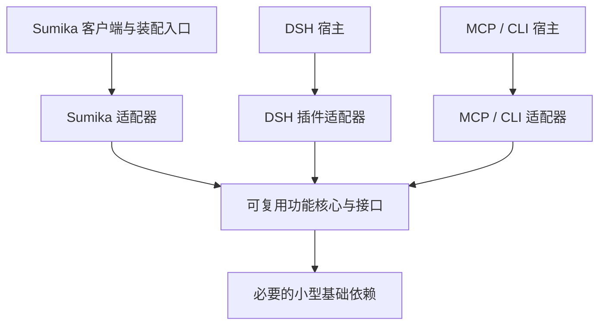
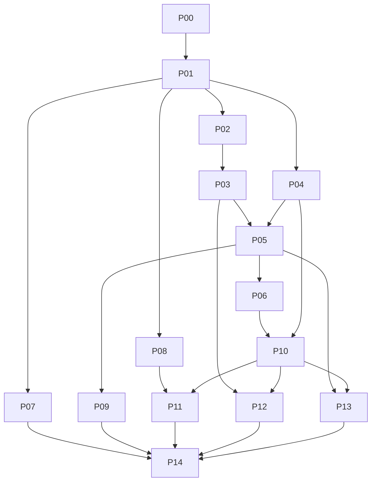

# Sumika 完整重构执行计划
## 可复用组件、双窗口客户端、质量优先路由与长期能力预留

## 一、计划定位与最终决策

本计划完整替换此前同主题计划，适合交给较低成本模型分任务实现。任务编号以本版为准。

本轮只进行了需求讨论和代码核对，**尚未实施本计划，也未将最近讨论全部写入项目文档**。

核对基线：

- 主仓库：`D:\Code\Sumika`。
- 当前提交：`a2a5f68`，核对时工作区干净。
- 前端沿用现有 JavaScript、HTML/CSS 和 Three.js，不更换框架。
- 后端沿用 Python，原生客户端沿用 Tauri 2。
- 已有独立 `quality-routing` SDK，其他部分仍存在应用级耦合。
- 已有 DSH 插件主要是调用 Sumika Core 的桥接，不能据此声称功能已经脱离 Sumika。
- 已有记忆 Provider 和多助手领域契约，但自动记忆、多人运行及合拆窗尚未完成。

实施前重新核对现场。新增工作必须保留，不能为了恢复上述基线覆盖用户修改。

### 1. 产品分工

| 对象 | 职责 |
|---|---|
| 角色模型 | 闲聊、理解需求、按需了解项目、角色附言 |
| 主模型 | 工作任务的复杂规划、关键推理、审查和重新规划 |
| 执行者 | 在满足任务质量要求的前提下完成具体任务 |
| 调度组件 | 提供候选、报价、分工、状态流转和验证安排 |
| 宿主客户端 | 控制身份、权限、凭据、预算确认、执行资源及界面 |
| Sumika | 使用上述组件，提供角色体验、工作台、居所与客户端交互 |

主模型与角色模型是**职责绑定**，不要求一定是不同型号；即使使用同一型号，也必须区分上下文、费用用途和输出规则。

### 2. 最新预算规则

| 情况 | 默认行为 |
|---|---|
| 普通闲聊，存在合格免费角色 | 直接交流 |
| 没有合格免费角色 | 提醒用户，确认后可以使用付费角色 |
| 确定免费且简单的工作 | 直接执行 |
| 需要付费的简单工作 | 展示预算，确认后执行 |
| 复杂工作，包括预计免费的复杂工作 | 展示目标、范围和预算，确认后开始 |
| 已确认工作范围内的子任务、修复和验证 | 在有效预算与权限内继续 |
| 超出目标、权限或消费上限 | 停止相关新增调用，重新确认 |

进一步固定：

- 主模型默认自动选择质量证据最强的可用候选，接受较高价格；不能把价格最高当作能力最高。
- **付费规划本身也要先确认。** 不得先调用主模型，再告诉用户规划已经产生费用。
- 仅打开工作台不调用模型。
- 切回闲聊不停止已经确认的工作；其费用继续归属工作任务。
- 闲聊不能在后台偷偷调用付费主模型完成未确认工作。
- 余额、登录状态和固定选模本身都不构成消费授权。
- 不为了免费降低角色表现或工作质量门槛。

### 3. 自动选择与手动指定

在设置中，为“负责交流”和“负责工作”分别提供：

- 自动选择，默认开启。
- 手动指定。
- 当前候选、渠道、实际应用的推理强度。
- 选择原因、健康状态、免费证据或价格。

手动模式：

- 可选择渠道、模型及已支持和验证的推理强度。
- 不可用时提示，不静默换模型。
- 选择付费模型不立即产生调用，也不跳过预算确认。
- 修改默认绑定只影响后续请求。
- 正在运行的任务保持原绑定；需要切换时通过任务重新规划处理。
- 切回自动模式后保留上次手动选择，方便再次切换。
- 配置按助手保存，为未来多角色分别绑定模型预留。

---

## 二、本轮交付范围与后续边界

### 1. 本轮正式实现

1. 用户界面精简和统一工作台。
2. 项目、对话和定时工作管理。
3. 角色免费优先、自动／手动选模。
4. 统一任务入口及预算确认。
5. 免费简单任务直达、复杂任务规划。
6. 项目浅认知和按需查询。
7. 工作成果与角色附言分离。
8. 最近三轮、加载历史和仅清除当前显示。
9. 工作台与独立陪伴两个原生窗口。
10. 陪伴小窗、全景、全屏和透明背景。
11. 路由组件的独立安装、示例与宿主适配验收。
12. 本轮新增或修改模块的依赖边界检查。

### 2. 本轮只做适配和预留

| 能力 | 本轮完成深度 |
|---|---|
| 长期记忆 | 稳定接口、作用域、后端能力声明、兼容和契约测试 |
| 多角色 | 助手状态、场所成员、视图绑定和模拟分组测试 |
| 自动合拆窗 | 确定性分组逻辑及窗口动作计划，不开启真实多人运行 |
| 社区组件 | 先完成路由组件本地独立验收；其他模块形成可提取边界 |
| 未来宿主 | 通过能力声明和适配接口预留，不伪造已接入状态 |

### 3. 延后实现

- 自动记忆抽取、语义召回、自动遗忘和共同经历生成。
- 多角色自主走动、多人真实合拆窗、群聊与互相交流。
- 语音、实时屏幕或摄像头观察。
- 视频游戏自动控制。
- 现实设备操作。
- Windows 真正嵌入桌面底层的壁纸模式。
- 所有模块一次性独立发包。
- 安装器发布、社区发布及远程推送。

保留已完成的刷新、模型池、渠道接入和账户证据，不为本轮重构重复测试所有模型或扩展新的免费渠道。

---

## 三、独立复用架构与验收标准

### 1. 正式需求

新增 `PLUGIN-003`：

> Sumika 的功能模块应具备清晰、可提取和可测试的边界；可复用核心能够通过明确适配器用于其他 Harness 或 Agent 客户端。Sumika 自身使用同一份核心实现。

该需求与现有插件替换、运行时适配及质量路由需求关联，不将已有桥接插件重新标记为独立核心。

### 2. 依赖方向



规则：

- 核心不导入 `CoreApplication`、Tauri、前端全局状态或 Sumika 的数据库实现。
- 适配器依赖核心契约，核心不导入具体宿主适配器。
- 装配入口负责把具体实现传给核心。
- 不把整个 `app` 换成一个同样庞大的 `HostContext` 来维持隐藏耦合。
- 只为实际依赖定义接口，避免提前建立通用插件平台。
- 可以共享进程、数据库和公共基础库；“独立”不等于零依赖或必须运行独立服务。
- 不要求每个模块单独建仓库，也不要求 Python 逻辑复制一份 JavaScript 版本。

### 3. 模块边界

| 模块 | 可复用部分 | 宿主或平台适配部分 |
|---|---|---|
| 质量路由 | 任务契约、候选选择、预算、DAG、验证和升级规则 | 用户确认、模型执行、任务存储 |
| 模型资源 | 价格、额度、证据、有效期、报价和共享预留规则 | 厂商读取、凭据引用、网页账户绑定 |
| 福利发现 | 线索收集、去重、核验状态、领取结果 | RSS／站点来源、登录浏览器和领取动作 |
| 项目与上下文 | 项目目录、资料引用、查询范围、上下文装配 | 宿主会话和文件读取 |
| 长期记忆 | 作用域、记录契约、生命周期、检索接口 | SQLite、外部仓库、HTTP/MCP、DSH 插件 |
| 定时工作 | 时间规则、到期判断、单飞和执行记录 | 宿主时钟、任务派发、维护服务 |
| 浏览器策略 | 动作规则、状态、幂等和权限判断 | BrowserSkill、WebView2 或其他浏览器 |
| Avatar 与场景 | 渲染状态、镜头、角色成员和布局逻辑 | Three.js、资源加载、图形环境 |
| 窗口管理 | 视图绑定和合拆窗动作计划 | Tauri、Windows 窗口与显示器 |
| Sumika 外壳 | 页面组合、角色体验、导航、托盘 | 保留为 Sumika 客户端代码 |

本轮优先让质量路由完整通过独立验收。其他新增代码必须遵守上述边界，但不能在未打包、未验证前标为“可独立复用”。

### 4. 核心实际需要的接口

按使用情况注入：

- 候选与质量证据查询。
- 报价与资金预留。
- 模型或工具执行。
- 结果验证。
- 用户授权查询。
- 任务、项目或记忆存储。
- 时钟、取消信号和事件通知。

要求：

- 接口输入输出使用版本化的数据对象。
- 不传整个会话历史、应用状态或凭据仓库。
- 报价不等于预留，预留不等于实际结算。
- 核心可以提出调用建议，最终执行前仍由宿主检查授权与额度。
- 凭据由宿主受控执行器使用，不通过模型工具参数传递。

### 5. “可独立复用”的正式验收

准备标记为独立组件时，必须同时满足：

1. 在干净环境中只安装组件及声明依赖即可加载运行。
2. 不启动 Sumika Core 或 Tauri，也不读取 Sumika 私有数据库和配置。
3. 有明确输入、输出、错误、能力声明及生命周期。
4. 有独立示例、行为测试、版本和许可证说明。
5. 能在至少一个独立 CLI、MCP 宿主或其他 Harness 中运行。
6. Sumika 与外部宿主使用同一份核心代码。
7. 缺少能力时明确返回不可用，不伪造成功或绕过权限。
8. 不隐式读取 Cookie、凭据、个人文件或调用付费服务。
9. 安装、配置、启动、停止和卸载行为有记录。
10. 发布包不包含个人模型、运行数据、账户快照或秘密。

浏览器、GPU 和窗口依赖可以存在，但必须明确声明并通过适配层连接。

**仅有插件目录、manifest 或 RPC 桥接，不满足上述验收。**

### 6. 首个独立示范：质量路由

沿用 `D:\Code\Sumika\packages\quality-routing`：

- 保留已有通用 DAG、报价和预算能力。
- 提取当前协作服务中可复用的工作流与证据接口。
- Sumika 的人格、会话、页面和当前应用配置留在适配器。
- 不再建立第二套重复调度器。

社区形式：

- Python SDK 是核心。
- MCP 是可选工具接口。
- DSH 使用薄插件连接独立组件；如需 Python，使用明确配置、受管的辅助进程，不复制算法。
- 现有 `dsh-route-bridge` 保留兼容，清晰标注仍依赖 Sumika。
- 新独立适配不得隐式依赖既有 Sumika RPC。

独立示例先使用明确标注的离线执行器验证完整生命周期；这只能证明组件与宿主适配，不冒充真实模型质量验收。

---

## 四、工作流、选模、预算与交付

### 1. 请求入口与状态

新增统一产品入口，建议方法：

- `work.task.preflight`
- `work.task.submit`
- `work.task.get`
- `work.task.list`
- `work.task.cancel`
- `work.authorization.confirm`

继续兼容现有 `quality.task.*` 与 `agent.session.*`，必要费用检查不能只存在于新界面。

状态至少区分：

```text
已接收
→ 预检
→ 等待澄清 / 等待预算确认 / 可执行
→ 规划（可选）
→ 执行
→ 验证
→ 完成 / 失败 / 已取消 / 提交状态未知
```

“等待确认”是正常业务状态，不显示成 Provider 错误。

每个工作请求保存：

- 稳定请求 ID 与需求版本。
- 来源入口和原始用户消息引用。
- 整理后的目标、交付形式和约束。
- 助手、会话、可选项目。
- 简单或复杂的判定依据。
- 预算、权限和候选范围。
- 原始执行来源及对应任务 ID。

### 2. 任务分流

优先使用本地规则、已知任务类型和已有能力证据：

| 类型 | 行为 |
|---|---|
| 确定性任务 | 现有工具可以准确完成时直接使用工具 |
| 简单模型任务 | 使用满足相应质量要求的单执行者 |
| 复杂任务 | 确认预算后进入 DAG 规划 |
| 不确定任务 | 澄清关键缺口，或按复杂任务处理 |

边界：

- 不只凭字数判断复杂程度。
- 不为了生成一个单节点计划先调用主模型。
- 基础抽取评测不证明复杂编程、研究或任意长篇总结能力。
- 分类步骤不额外调用付费模型。
- 简单任务也必须验证，但不固定追加贵主模型审查。
- 复杂任务保留原质量基准和最终验收。

### 3. 闲聊与工作衔接

- 普通讨论、设想和抱怨不自动变成任务。
- 明确交办时，角色形成简短摘要，并保存原话防止转述丢失约束。
- 免费简单工作可以直接做，提供成果或工作记录链接。
- 其他工作进入工作台预算待确认状态，不在闲聊后台调用主模型。
- 用户可以编辑目标、交付形式和关键假设。
- 工作台明确输入直接进入统一入口，不强制由角色再转述一次。
- 角色模型不支持工具调用时，不解析普通角色台词作为可执行命令；使用明确按钮或经过结构校验的交办入口。

### 4. 选模规则

#### 主模型自动模式

- 按适用任务的质量证据选择最强可执行候选。
- 不为了低价自动降到较弱主模型。
- 新候选须满足已有健康、身份和评测门槛。
- 候选失效时重新形成预检和建议，不让旧任务无声换模型。
- 预算确认前不调用它。

#### 角色模型自动模式

1. 过滤未授权、不健康、角色质量不达标、推理强度未验证的候选。
2. 根据本次请求检查免费价格或有效赠送／限免资源。
3. 在合格免费候选中保留仍合适的当前候选，减少无意义切换。
4. 当前不可用时尝试其他合格免费候选。
5. 没有合格免费候选时返回付费建议，等待用户确认。

付费角色仍承担角色职责，不因此把闲聊变成主模型工作。

#### 执行模型

- 先满足任务质量、权限和能力，再比较实际成本。
- 保留官方、中转、网页及 Harness 的独立 Route 身份。
- 推理强度属于候选身份和成本输入。
- 手动固定角色或主模型，不等于强制所有子任务使用同一型号。

### 5. 预算与授权

资金分类继续保留：

- 官方免费。
- 赠送资源。
- 限时免费或活动抵扣。
- 已购资源包。
- 现金。
- 未知。

规则：

- 已购资源消耗不能因本次现金扣款为零而标为免费。
- 同一资源包跨模型共享预留，优先有效且较早到期的适用赠送资源。
- 发送前重新检查价格版本、额度、到期和授权。
- 金额使用现有精确金额类型，不使用浮点累计。
- 所有模型用途都进入预算：规划、执行、验证、重试、咨询、角色附言和未来记忆处理。
- 确定性预算先给最低、通常、偏高范围及关键假设。
- 简单付费任务也要确认。
- 复杂免费任务显示预计费用为零、资源使用与范围，仍需任务确认。
- 初次估算无法覆盖整体时，只请求有明确上限的规划授权。
- 一次确认可以覆盖该任务的规划、执行、验证和范围内修复。
- 保留“两倍且多 ¥5”的可调异常阈值；明确消费上限始终不能被该阈值放宽。
- 默认角色付费确认覆盖当前请求；只有用户明确选择，才扩为有上限的会话授权。
- 缺少可靠费用边界时显示未知，不构造虚假上限。

确认只来自客户端用户交互或有效宿主授权接口。模型工具不能调用确认入口，模型生成的 `approved=true` 不算授权。

原生 Harness 如果不能逐调用控制或强制消费上限，必须显示该限制，不把它纳入承诺强制上限的自动路径。

### 6. 修复、升级和重新规划

- 明确未发送的失败可以按策略尝试其他合格候选。
- 已产生部分输出或提交状态未知时，不自动重发。
- 先做一次有依据的原候选修复；仍失败则选择达标替补或重新规划。
- 更换执行者不能降低原质量基准。
- 目标变化、费用变化、权限冲突、上下文超限会触发预检或重新规划。
- 保留未受影响且已验证的节点成果。
- 相同任务、版本和尝试使用幂等标识。
- 取消停止新增派发，已发送调用按真实状态结算或保留未决预留。

### 7. 工作成果保持干净

当前“角色引言＋成果”拼接存储需要取消。

新增独立对象：

- `WorkArtifact`：任务、版本、原文或文件引用、格式、来源、校验值、验证状态。
- `RoleCommentary`：助手、关联成果或事件、独立文字、生成状态。

规则：

- 工作提示不加入角色口癖。
- 用户要求的写作风格仍作为任务约束保留。
- 角色不重新组织或改写技术正文。
- 复制正文、保存笔记、导出和后续任务输入只使用成果。
- 多份成果分别保存。
- 用户要求修改时生成新版本。
- 附言只使用已验证状态和必要标题，优先用模板。
- 不为一句装饰性附言固定调用主模型复审。
- 附言失败、无免费角色或预算不足时，工作成果正常交付。
- 历史拼接文本不猜测拆分；只有可靠原始结果存在时提供独立正文。

---

## 五、项目、历史与长期记忆

### 1. 项目模型

项目是长期主题容器，不等同 Git 仓库。

字段至少包括：

- ID、名称、分类、一句话用途。
- 助手归属和可访问范围。
- 用户手动编辑标记。
- 关联对话和任务引用。
- 可选目录绑定。
- 归档状态与更新时间。

分类：

- 学习。
- 编程。
- 生活。
- 健康与运动。
- 研究与创作。
- 自定义。

分类不限制能力。学习项目可以编程，生活项目也可以生成文件。

自动命名和分类：

- 优先使用已存在内容。
- 必要语义处理只走合格免费路径。
- 免费能力不足时使用清楚的临时名称，不自动付费。
- 用户改过的字段不再覆盖。
- 不在每条流式消息到达时重新生成。

### 2. 对话统一展示

采用来源引用，不复制外部执行历史：

- Core 聊天。
- Quality 工作任务。
- 受管 Agent 会话。
- 已有网页会话。

保留来源、原始 ID 和能力状态：

- 不凭标题相同合并。
- 不凭目录相似自动关联。
- 旧记录先放未归类。
- 来源不可用时显示缓存摘要和状态，不伪造继续执行能力。
- 工作台统一呈现，来源引擎仍是执行事实来源。

### 3. 角色对项目的认知

默认只提供相关目录级信息：

- 项目名称。
- 分类。
- 一句话用途。

提及时再查询：

1. 按名称、当前项目和近期指代定位。
2. 有实质歧义再问。
3. 先取概况，再按问题取相关成果、对话片段或已授权文件。
4. 返回来源与更新时间。
5. 不默认读取整个工作目录。
6. 不把查到的全部原文自动写成长期记忆。

### 4. 最近三轮与清屏

“最近三次”按最近三轮问答处理：

- 用户消息开启一轮。
- 对应回复、工具记录和补充输出归属同轮。
- 未完成轮保留。
- 不简单等同最后六条消息。

新增稳定游标分页，旧全量接口保留兼容：

- 首次进入或应用重启：最近三轮。
- 加载之前对话：每次追加十轮。
- 按消息 ID 去重。
- 保持滚动锚点。
- 清屏只更新当前显示边界，不删数据库、不创建新会话。
- 同次运行重绘、窗口切换和模式切换不自动填回。
- 用户可以主动加载恢复。

服务端上下文构建独立于显示数组；不要求每次发送全部历史，但不能因清屏导致模型丢失可检索历史。

### 5. 长期记忆适配

本轮只实现接口与边界：

- 记忆属于稳定助手身份。
- 兼容当前 `character_id`，明确映射 `assistant_id`。
- 模型、Avatar、窗口和后端变化不改变归属。
- 人格设定、长期记忆、聊天历史、项目资料分别管理。
- 项目最新事实不被旧记忆覆盖。
- 查询结果和删除操作均检查作用域。
- 返回记录包含来源、时间、修订和有效状态。
- 保留现有查询、添加、删除和健康接口，为更新、语义搜索、导出导入预留版本化扩展。
- 后端声明支持的能力，不支持时明确返回。
- 不直接比较不同后端的相似度分数。
- 模块关闭时零后端调用。
- 后端故障不阻塞正常聊天。
- 记忆不能授予付费、执行或数据共享权限。

未来替换后端：

- 通过统一适配器连接开源仓库、独立服务或 DSH 插件。
- 同一执行路径只保留一个自动写入和上下文注入入口。
- 不能控制自动注入、作用域或费用的插件，只能标注为特定宿主能力，不能当作全局记忆系统。
- 迁移正文、来源、归属、有效删除状态；向量索引通常重建。
- 不支持完整导出的后端明确标注限制。
- 删除记忆不能在换后端或重建索引后复活。

本轮不选具体产品，不扫描历史，不启用自动召回或自动记忆。

---

## 六、界面、独立窗口与多角色预留

### 1. 主客户端

保留 A 方案：

- 暖白、浅木、低饱和基础色。
- 角色强调色可配置，为更鲜明的二次元角色留出空间。
- 文字导航为主，不强迫用户猜图标。
- 不再制作新的五套风格。

导航：

- 工作台。
- 能力。
- 角色。
- 设置。
- 独立“打开居所”入口。

主客户端默认进入工作台。

### 2. 工作台布局

**左侧：**

- 新建对话。
- 搜索。
- 项目。
- 未归类对话。
- 定时工作。
- 置顶和归档管理。

**中央：**

- 工作对话。
- 需求与预算确认。
- 任务进度。
- 干净成果。
- 独立角色附言。

**右侧按需展开：**

- 文件。
- 产物。
- diff。
- 内置浏览器。

整合旧 Agent、网页工作台、任务、历史和通知入口。保留既有引擎，不再复制任务系统。

高级信息：

- PID、版本、协议名、原始日志、路由 ID、Token 明细等收进高级诊断。
- 实际故障、费用、待确认动作和重要状态保持普通用户可见。

### 3. 能力与设置

能力页分类：

- 感知与交互。
- 效率工具。
- 生活与陪伴。

模块规则：

- 已添加模块末尾放同尺寸虚线卡片，中央只有「＋」。
- 悬停或聚焦提示添加模块。
- 点击进入模块库。
- 已加入模块不重复添加。
- 排序和移除进入整理状态。
- 添加卡片、启用能力、授予权限分别处理。
- 添加模块不能自动开始录音、观察或付费。
- 移除卡片不删除数据或关闭其他页面仍在使用的能力。

设置中集中放模型连接、角色／主模型自动手动开关和预算偏好，不在多页重复配置。

### 4. 独立陪伴窗口

同一个陪伴视图支持：

- 紧凑小窗。
- 普通全景窗口。
- 当前显示器全屏。
- 可关闭场景背景，显示透明角色。

默认内容：

- 场景。
- 角色。
- 短气泡。
- “聊一句”展开紧凑输入框。

窗口扩大只调整尺寸、镜头和布局，不改变角色所在房间。

行为：

- 紧凑默认置顶，全景默认普通层级，可手动修改。
- 可以放到副屏展开，主屏继续工作。
- 输入框和按钮不触发拖动。
- 不主动抢焦点，不默认鼠标穿透。
- 保存尺寸、位置和显示器信息。
- 副屏断开后恢复到可见工作区域。
- 隐藏、最小化和锁屏暂停不可见渲染。

### 5. 生命周期

- 工作台和陪伴共享一个 Core 和受管后台。
- 分别保存输入草稿，共享助手和真实任务状态。
- 关闭工作台表示收起；陪伴和已授权后台任务继续。
- 关闭陪伴表示隐藏，不删除助手或任务。
- 托盘提供恢复和明确退出。
- 首次解释关闭行为。
- 完全退出才停止应用后台和网络维护。
- 退出过程中保留未知提交及未决费用，不假装取消已经发送的上游请求。
- 内置浏览器仍由工作台承载，陪伴不获得全部敏感原生命令权限。

### 6. 多角色与合拆窗接口

分开以下对象：

1. 助手身份。
2. 世界或公寓实例。
3. 房间。
4. 助手所在房间和活动点。
5. 房间成员列表。
6. 视图绑定。
7. 原生窗口偏好。

未来规则：

| 情况 | 展示 |
|---|---|
| 两位角色各在卧室 | 两个房间窗口，可分别展开 |
| 两位进入同一客厅 | 合为包含两人的窗口 |
| 再去不同房间 | 拆分对应窗口 |
| 同房间换座位 | 更新角色位置，不拆窗 |
| 不同公寓使用相同素材 | 保持分开 |

本轮：

- 实现状态契约和纯分组函数。
- 输出保留、重绑、新建、隐藏的动作计划。
- 使用模拟成员变化测试。
- 日用仍只有单角色，不实现自主走动和多人合窗动画。

窗口承载优先级：

1. 已显示目标房间的窗口。
2. 参与合并且正在交互的陪伴窗口。
3. 参与合并中最早创建的窗口。

保留承载窗口位置、显示器与全屏状态，不抢焦点。交接成功后再隐藏冗余视图；失败保留原显示。

合窗不共享记忆和私聊。未来输入框必须明确当前交流对象；本轮不实现默认群聊。

---

## 七、定时工作与既有自动维护

### 1. 用户定时工作

支持：

- 一次性。
- 每天。
- 每周。
- 明确时区，默认 `Asia/Shanghai`。
- 关联助手和可选项目。
- 暂停、修改、立即执行和结果历史。

创建日程不必调用模型。

执行通过统一工作入口，不建立第二套执行器。

### 2. 与预算规则的关系

- 新日程默认零付费。
- 创建时确认日程的目标、重复规则和执行范围，作为该日程的持续任务授权。
- 符合已确认范围的后续周期无需每次再确认。
- 未授权付费时，免费能力不足就记录未执行，不自动付费。
- 单项付费日程必须明确授权可用范围与每次或累计消费上限。
- 修改目标、扩大费用或权限后重新确认。
- 不将普通任务授权自动扩展成长期日程授权。

### 3. 到期与恢复

- 时间计算使用可注入时钟。
- 每个计划时点有持久化执行标识。
- 同一日程有运行中或提交未知的尝试时，不重复派发。
- 完全退出期间不联网。
- 启动后补查维护任务。
- 普通周期任务跳过错过时点。
- 一次性任务错过后显示待补跑，由用户决定执行。

### 4. 应用维护

已有价格刷新、额度检查、福利发现和签到：

- 在工作台中投影到默认折叠的“应用维护”。
- 复用现有运行服务和单飞逻辑。
- 不新注册第二份相同任务。
- 高频任务仍以确定性脚本为主。
- 语义处理只有在必要且有合格免费候选时使用模型。
- 不因为 DSH 安装了定时插件，就默认让模型定期唤醒。
- 本轮不扩充所有网站适配，也不重做已完成的渠道验收。

---

## 八、实施任务包

### 1. 执行总则

每包必须包含：

- 目标与依赖。
- 输入契约。
- 允许修改范围。
- 不允许自行改变的边界。
- 验收场景。
- 实际测试结果。
- 待整合入口与剩余限制。

以下共享文件由接手主 Agent 串行整合：

- `D:\Code\Sumika\backend\src\sumika_core\server.py`
- `D:\Code\Sumika\backend\src\sumika_core\storage.py`
- `D:\Code\Sumika\backend\src\sumika_core\protocol\models.py`
- `D:\Code\Sumika\frontend\main.js`
- `D:\Code\Sumika\src-tauri\src\main.rs`
- 公共契约、迁移、依赖清单与锁文件。

局部执行者只改分配模块，返回注册位置和签名，不各自修改共享入口。

### P00：需求落盘与基线

**依赖：无。风险：低。**

修改文档：

- `D:\Code\Sumika\docs\requirements`
- `D:\Code\Sumika\docs\status-matrix.md`
- `D:\Code\Sumika\docs\current-execution.md`
- 新计划：`D:\Code\Sumika\docs\refactor\client-workflow-v2.md`
- 新架构规范：`D:\Code\Sumika\docs\architecture\reusable-components.md`

交付：

- 完整保存本计划。
- 新增 `PLUGIN-003` 及对应状态映射。
- 补齐本轮 UI、模型选择、预算、记忆、窗口需求。
- 原话只引用可核实的用户消息，不把助手建议伪装为用户逐字原话。
- 标明旧规则被哪些新决定替代。
- 重新计算需求统计。
- 当前执行记录保持简短，详细内容链接到计划文档；遵守现有文档检查器格式。
- 记录代码基线、已有变更和历史验收。

验收：文档、JSON、引用和需求状态一致；不得标记代码已实现。

### P01：依赖边界与公共契约

**依赖：P00。风险：高。**

交付：

- 固定请求、授权、成果、项目、对话引用、记忆和视图契约。
- 确定版本兼容，保留旧严格字段协议的读取适配。
- 将新模块分成核心、适配器和装配入口。
- 为实际需要的依赖定义小接口。
- 确定新增表和迁移归属，不让多个包各自修改 schema 版本。
- 保留原消息和外部任务事实来源。
- 提供其他任务包共用 fixture。

验收：

- 核心不导入 Sumika 应用对象。
- 旧快照、新空库、旧库升级可读取。
- 新增字段不清空原数据。
- 核心接口不存在循环依赖。

### P02：提取通用路由、证据和资源边界

**依赖：P01。风险：高。**

重点：

- `D:\Code\Sumika\packages\quality-routing`
- 当前 `quality`、`model_policy`、报价和资金模块。

交付：

- 保留已有 SDK 算法，提取仍混在 Sumika 服务中的通用部分。
- 将候选、质量、报价、预留和结算分清。
- 移除通用流程对整个 `app` 的访问。
- 厂商读取和 Provider 配置留在适配器。
- Sumika 使用提取后的同一实现。
- 不建立第二套报价或余额账本。

验收：

- 现有质量、价格、额度和升级测试保持通过。
- 不同渠道及推理强度仍隔离。
- 过期证据和未知费用不会变成免费。
- 通用核心在无 Sumika 应用实例时可运行。

### P03：预算准入与自动／手动选模

**依赖：P02。风险：高。**

交付：

- 实现角色免费优先及付费待确认。
- 主模型按质量优先选择。
- 分别支持自动／手动设置。
- 实现免费简单免确认，其余工作先预算确认。
- 规划、验证、附言同样受费用控制。
- 固定候选不可用不静默替换。
- 手动配置修改只作用后续请求。
- 新确认绑定请求版本、用途和上限。
- 核验原生 Harness 的费用控制能力并标明限制。

验收：

- 未确认付费调用数为零。
- 复杂免费任务也等待任务确认。
- 免费失效不自动现金回退。
- 角色付费候选可确认使用，不被永久禁止。
- 并发预留和旧版本拒绝正确。

### P04：项目、对话索引与历史上下文

**依赖：P01。风险：中高。**

建议独立模块：

- `D:\Code\Sumika\backend\src\sumika_core\projects`
- 上下文核心与 Sumika 会话适配器。

交付：

- 项目管理及可选目录关联。
- 来源明确的对话引用。
- 未归类历史、项目关联和搜索。
- 浅目录查询与按需详情查询。
- 最近三轮、十轮追加和稳定游标。
- 服务端上下文不依赖前端显示数组。
- 自动命名和分类的免费处理入口。
- 只通过存储接口访问数据，不接收整个应用对象。

验收：

- 不跨助手和项目读取。
- 提及前不读项目正文。
- 清屏不删历史。
- 工具消息、多段回复、并发新消息下分页正确。

### P05：统一工作流与简单任务直达

**依赖：P03、P04。风险：高。**

交付：

- 新统一工作入口。
- 确定性工具、单执行者和复杂 DAG 分流。
- 复用现有 Quality、Agent、网页执行能力。
- 闲聊交办先形成请求，不直接调用付费规划。
- 工作任务默认由所选主模型承担需要其能力的部分。
- 结构化消息和工具调用正确传递。
- 不将普通自然语言回复解释为可执行授权。
- 统一取消、修复、重新规划和未知恢复。
- 来源适配器只转换协议，不复制工作流规则。

验收：

- 免费简单任务零主模型规划。
- 复杂任务确认后能进入已有 DAG。
- 付费规划前正常等待。
- 双击、重连、重复事件不重复派发。
- 普通讨论不自动执行。

### P06：干净成果与角色附言

**依赖：P05。风险：中高。**

交付：

- 独立成果与附言对象。
- 移除新任务的拼接保存和固定引言复审链。
- 复制、笔记、导出和依赖输入只取正文。
- 多成果和版本管理。
- 原生 Agent 结果同样不被角色重写。
- 保留旧格式兼容。

验收：

- 附言前后原文校验一致。
- JSON、代码和 Markdown 不受污染。
- 角色不可用仍交付成果。
- 旧消息正常显示。

### P07：长期记忆适配

**依赖：P01。风险：中。**

重点：

- `D:\Code\Sumika\backend\src\sumika_core\memory`
- 当前记忆 Provider 和 registry。

交付：

- 分离通用记忆规则与 Sumika 模块、事件和存储适配。
- 稳定身份、作用域与外部返回校验。
- 能力声明、更新与迁移扩展契约。
- 上下文来源接口。
- 保留 SQLite 和 JSONL 手动功能。
- 文档说明未来 DSH/HTTP/MCP 接法。

验收：

- 模块关闭零调用。
- 错误归属被拒绝。
- 不支持的能力明确返回。
- 本轮零自动召回、零自动记忆。
- 无真实外部服务也能完成契约测试。

### P08：场所与视图分组

**依赖：P01。风险：中。**

交付：

- 场所实例、房间、成员和视图绑定。
- 单角色状态映射。
- 独立于 Tauri 的分组函数。
- 合拆窗动作计划及稳定承载选择。
- 过期事件和重复事件处理。

验收：

- 卧室分离、客厅会合、再次分离正确。
- 同房间活动点不同不拆分。
- 不同公寓同名房间不合并。
- 模式变化不改变成员。
- 不启用真实多人运行。

### P09：独立组件与 DSH/MCP 包装验收

**依赖：P02、P03、P05。风险：中高。**

交付：

- 路由 SDK 独立安装与示例。
- 可选 MCP 接口，明确哪些操作可用。
- DSH 薄适配器，脱离 Sumika Core 的加载及生命周期。
- 宿主授权仍由用户界面或可信回调提供，模型工具不能自行批准。
- 进程路径、参数和数据目录明确配置。
- 旧 Sumika bridge 保留兼容并正确命名。
- 不读取 Sumika 运行库或搬运凭据来伪造独立运行。

验收：

- 干净环境运行时没有 `sumika_core` 依赖。
- 离线示例完成提交、执行、验证、取消和恢复。
- DSH 隔离 profile 实际加载；仅测试 fixture 的部分明确标注。
- 若具体 DSH API 无法支持某能力，报告限制，不声称完全可用。
- 不发布到社区仓库或包注册表。

### P10：工作台与历史界面

**依赖：P04、P05、P06。风险：中。**

交付：

- 左侧项目、对话和定时入口。
- 中央对话、预算、进度、成果。
- 右侧文件、diff 和内置浏览器。
- 原分散入口整合。
- 项目分类、归档、重命名和搜索。
- 三轮历史、加载与清屏。
- 独立正文复制和附言展示。
- 组件使用明确输入和动作回调，不直接读取整个全局状态。

验收：

- 普通用户可以完成新建项目、发任务、确认预算和取成果。
- 没有重复平级入口。
- 草稿和用户标题不被重绘覆盖。
- 来源不可用时原因清楚。
- A 方案一致性保持。

### P11：原生双窗口

**依赖：P08、P10。风险：高。**

交付：

- 工作台和陪伴两个真实窗口。
- 一个 Core、一个受管后台。
- 紧凑、全景、全屏、透明背景。
- 位置、尺寸、DPI 和多屏恢复。
- 托盘恢复和明确退出。
- 原生命令按窗口职责授权。
- 场景渲染生命周期与任务生命周期分离。
- 更新旧显示模式兼容调用。

验收：

- 展开不换房间或重置助手。
- 输入不拖窗、不抢焦点。
- 隐藏不取消已确认任务。
- 陪伴不能调用工作台敏感浏览器命令。
- 单实例后台，退出不误杀非自有服务。
- 原生多窗口验收不能用普通浏览器标签代替。

### P12：能力、角色与设置整理

**依赖：P03、P10。风险：中。**

交付：

- 三类能力页和纯加号模块库。
- 整理模式、排序和移除。
- 主／角色自动手动开关及候选说明。
- 费用偏好和预算上限。
- 高级诊断收起。
- 记忆手动管理入口。
- 默认模型与个人资源分发边界保持。

验收：

- 添加不启用，启用不自动授权。
- 移除不删数据。
- 免费角色不足能进入付费确认。
- 手动候选不可用不替换。
- 键盘操作和未配置状态正确。

### P13：定时工作

**依赖：P03、P05、P10。风险：中高。**

建议独立调度核心与 Sumika 任务适配器。

交付：

- 日程、时间规则、执行记录、单飞。
- 一次性、每日、每周及时区。
- 统一工作入口派发。
- 零付费默认及明确持续授权。
- 既有维护服务状态投影与操作转交。
- 启动补查、错过时点和未知尝试处理。

验收：

- 使用可注入时钟。
- 同一计划时点只执行一次。
- 暂停、修改和重启正确。
- 不重复现有维护调度。
- 完全退出不联网。

### P14：整合、迁移与最终验收

**依赖：全部。风险：高。**

交付：

- 共享入口集中整合。
- 旧数据升级、原接口兼容和客户端切换。
- 独立组件、后端、前端、原生检查。
- 桌面快捷方式一键启动验证。
- 需求和执行记录更新。
- 清理无用临时产物，保留复用工具和证据。
- 完成改动、验证、限制及恢复说明。

不得：

- 把接口预留当成自动记忆或多人生活已完成。
- 把 fixture 当真实模型或设备验收。
- 为通过测试删除关键断言。
- 未经本次发布安排自行提交、推送或发布安装器。

### 依赖概览



---

## 九、测试、迁移与交接标准

### 1. 核心验收矩阵

| 编号 | 场景 | 必须结果 |
|---|---|---|
| V01 | 免费简单工作 | 直接完成，零主模型规划调用 |
| V02 | 复杂免费工作 | 展示零费用预算，确认前不开始规划 |
| V03 | 付费简单工作 | 确认前零调用 |
| V04 | 付费规划或验证 | 同样在授权前阻断 |
| V05 | 免费角色可用 | 优先使用合格免费候选 |
| V06 | 免费角色均不可用 | 提醒后可选择付费，不静默付费 |
| V07 | 手动指定失效 | 提示，不自动换模型 |
| V08 | 修改默认模型 | 不改变正在运行任务 |
| V09 | 已购资源抵扣 | 不标为免费 |
| V10 | 免费证据失效或额度不足 | 发送前重检，不现金回退 |
| V11 | 并发调用 | 共享预留，不超额 |
| V12 | 请求修改与旧授权 | 旧版本不能授权新目标 |
| V13 | 重连、双击和重复事件 | 不重复任务 |
| V14 | 网页提交未知 | 不重发 |
| V15 | 正文与附言 | 校验值、复制、导出保持干净 |
| V16 | 附言不可用 | 成果仍可交付 |
| V17 | 项目未提及 | 不读正文 |
| V18 | 跨助手或项目访问 | 被拒绝 |
| V19 | 清屏和分页 | 不删除记录、不改变上下文依据 |
| V20 | 记忆模块关闭 | 零后端访问 |
| V21 | 外部记忆错误归属 | 不接纳、不越权删除 |
| V22 | 模拟同房间和分房间 | 视图分组正确 |
| V23 | 小窗展开 | 场所、成员、会话不变 |
| V24 | 双窗口 | 一个 Core，后台不重复 |
| V25 | 陪伴越权原生命令 | 被拒绝 |
| V26 | 定时任务重复到期 | 只执行一次 |
| V27 | 完全退出 | 停止应用网络维护 |
| V28 | 独立路由安装 | 无 Sumika Core 也可运行 |
| V29 | 迁移 | 原会话、资源、登录档案保持 |
| V30 | 分发检查 | 不含个人模型和秘密 |

### 2. 测试环境

优先使用隔离数据库、临时端口和显式 fixture。正常测试不连接日用 DSH 会话，不读取真实凭据。

PowerShell 源码环境：

```powershell
Set-Location 'D:\Code\Sumika'
$env:PYTHONPATH = 'D:\Code\Sumika\backend\src;D:\Code\Sumika\packages\quality-routing\src;D:\Code\Sumika\backend\tests'
```

隔离 worktree 中替换为该 worktree 的绝对路径。

### 3. 必要验证命令

按修改范围先运行专项，最终整合运行：

```powershell
python -m unittest discover -s 'D:\Code\Sumika\backend\tests' -p 'test_*.py'
python -m unittest discover -s 'D:\Code\Sumika\packages\quality-routing\tests' -p 'test_*.py'
npm --prefix 'D:\Code\Sumika\frontend' run test:unit
npm --prefix 'D:\Code\Sumika\frontend' run test:e2e
npm --prefix 'D:\Code\Sumika\frontend' run build
cargo test --manifest-path 'D:\Code\Sumika\src-tauri\Cargo.toml'
cargo build --manifest-path 'D:\Code\Sumika\src-tauri\Cargo.toml' --features custom-protocol
python 'D:\Code\Sumika\tools\check_docs.py'
python 'D:\Code\Sumika\tools\check_release_assets.py'
git diff --check
```

另行运行新独立适配器自身测试和干净环境安装示例。独立安装测试必须取消源码 `PYTHONPATH`，在仓库外执行，避免误从主仓库导入。

不为纯文档变更新增复述文案的测试。检查通过后，只有新改动或具体疑点才扩大、重复验证。

### 4. 原生与视觉证据

更新复用：

`D:\Code\Sumika\tools\native-ui-smoke.mjs`

不能继续沿用旧单窗口断言来证明新双窗口正确。

至少检查：

- 工作台 1440×900。
- 工作台 1280×800。
- 陪伴约 480×420。
- 同场景全景和全屏。
- 模块库展开。
- 预算确认。
- 成果和独立附言。
- 透明画布、角色非空白和面部无遮挡。
- 关闭、托盘、焦点与单实例后台。
- 有副屏时实际验证副屏和拔屏恢复；没有硬件则记录模拟覆盖与实机缺口。

真实模型验收只覆盖本轮变化的链路，优先使用已验证免费候选。新增付费验证遵守本计划，不重跑此前全部模型基础题。

### 5. 数据与发布边界

- 迁移前备份涉及的数据库和设置。
- 不批量重写历史聊天。
- 不复制外部 Harness 全部历史到新表。
- 不搬 Cookie，不更换登录档案来规避兼容问题。
- 不清除旧费用预留或用余额猜测结算。
- 默认 Sample A 保留许可和来源信息。
- 安和昴等个人模型仅本地保留。
- 不因重构删除旧实现、运行库或资源。
- 本计划交付本地可审查结果；远程发布另行执行。

### 6. 较低成本模型的工作方式

单执行者可顺序执行：

```text
P00 → P01 → P02 → P03 → P04 → P05 → P06
→ P07 → P08 → P09 → P10 → P11 → P12 → P13 → P14
```

具备子 Agent 时：

- P01 后，项目、记忆和视图分组可在契约固定后独立开发。
- 费用、授权、迁移、协作核心和原生权限整合保持串行。
- 并行写入使用隔离 worktree；不支持时直接串行。
- 不因缺少子 Agent、模型注册表或预算工具停止任务。
- 不自动更换用户选择的执行模型。

每包返回：

```text
任务编号：
状态：已实现 / 部分完成 / 受阻

实际行为：
修改文件：
测试命令与结果：
证据位置：
尚未覆盖：
需要整合的入口：
下一步：
```

发现需要改变公共契约、权限、费用语义或迁移边界时，由接手主 Agent 统一修订。若能力不足，保留可恢复状态并请求有针对性的审查，不能通过放宽规则解决。

### 7. 最终完成标准

只有以下条件同时满足才标记本轮完成：

- 本轮正式实现项已经接入真实客户端。
- 费用和授权规则覆盖所有相关入口。
- 角色与主模型自动／手动选择可实际使用。
- 工作正文保持干净。
- 双窗口通过原生验证。
- 路由组件通过独立运行验收。
- 记忆和多角色预留通过契约测试，但未冒称完整实现。
- 旧数据、登录和个人模型保持。
- 文档、状态矩阵和执行记录准确。
- 所有未完成真实验收都有明确限制和恢复动作。

实施开始后，先完成 P00，将本计划和需求原话保存到项目；随后按任务包推进，不再从头重新讨论已经确认的产品方向。
